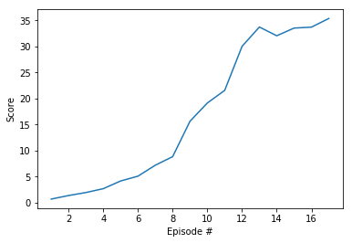
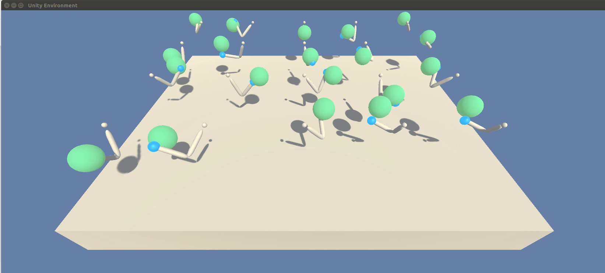

# Project Report: Continuous Control - DDPG DRL algorithm 

### Introduction

For this project, an intelligent agent is trained to control a double-joined arm to target locations. A reward of +0.1 is provided for each step that the agent's hand is in the goal location. Thus, the goal of the agent is to maintain its position at the target location for as many time steps as possible. After training for only 12 episode, the average score of the 20 agents reaches above 30.

### Algorithm
Deep Deterministic Policy Gradients (DDPG) is a policy-gradient actor-critic algorithm. It is off-policy and model-free. The Actor-Critic learning algorithm is applied to represent the policy function independently of the value function. The policy network that generate the actions given an input states is known as the Actor; and the value network that generate the values given input states and actions is known as Critic. The detailed algorithm is introduced as below two figures:

### Model Architechture

- **_Actor Network_**
    - Hidden: (state_size, 256) - ReLU
    - Hidden: (256, 128) - ReLU
    - Output: (128, 4) - TanH

- **_Critic Network_**
    - Hidden: (state_size, 256) - ReLU
    - Hidden: (256 + action_size, 128) - ReLU
    - Output: (128, 1) - Linear

### Hyperparameters
 - BUFFER_SIZE = int(1e6)  # replay buffer size
 - BATCH_SIZE = 128        # minibatch size
 - GAMMA = 0.99            # discount factor
 - TAU = 1e-3              # for soft update of target parameters
 - LR_ACTOR = 1e-3        # learning rate of the actor 
 - LR_CRITIC = 1e-4        # learning rate of the critic
 - LR_DECAY = 0.99         # In each episode, the learning rate is decayed by a factor
 - NOISE_DECAY_FACTOR = 0.999         # noise decay factor after each sampling

 - device = torch.device("cuda:0" if torch.cuda.is_available() else "cpu") # the network is run on Nvida GPU  1080

### Results
During the training process, the learning rate of two networks decay with the episodes. Also, the noise temperature also decays at each sampling event. These tricks help improve the training speed greatly.

The recored of the training process is plotted as below:

The trained agent can catch the motion of the balls very well.

### Further Improvements
 - D4PG and PPO algorithm worth a try for this project.
 - Train the agent in distributed system to improve the speed.
 - Crawer enviroment is going to be tested.
 
### Reference
https://pemami4911.github.io/blog/2016/08/21/ddpg-rl.html

https://towardsdatascience.com/introduction-to-various-reinforcement-learning-algorithms-i-q-learning-sarsa-dqn-ddpg-72a5e0cb6287
